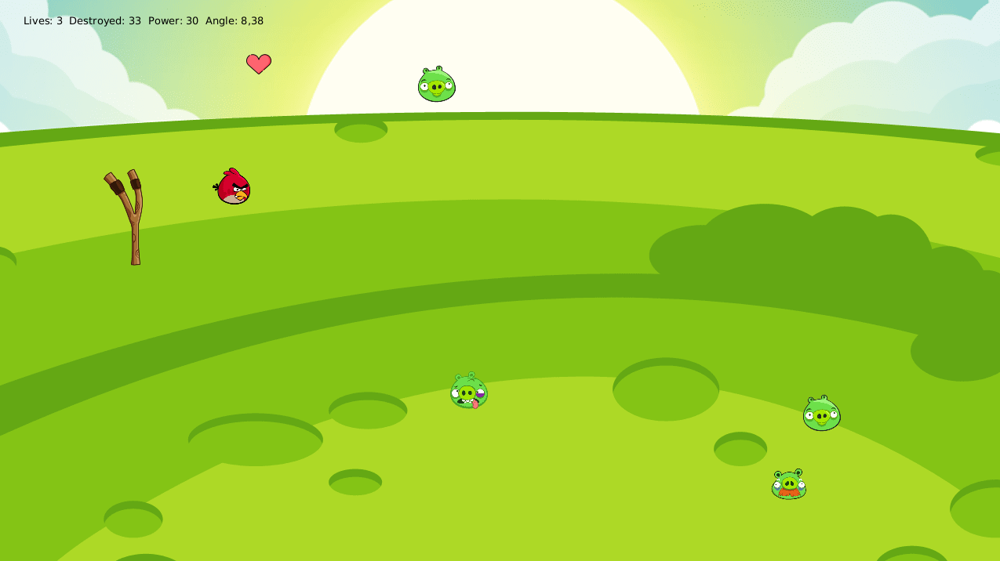
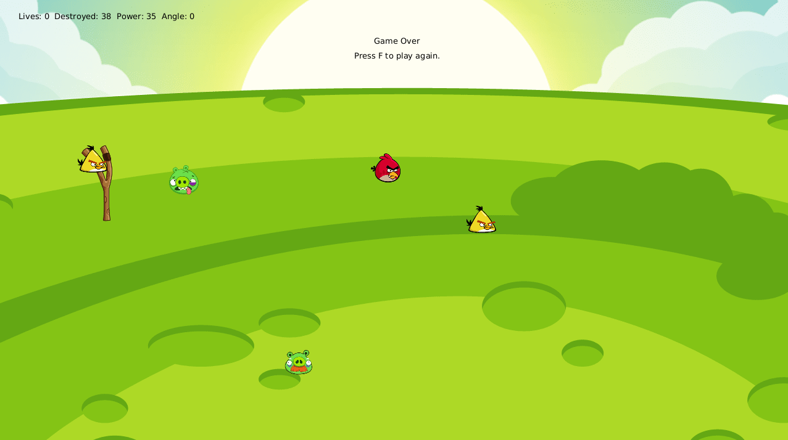

# Hit the Pig

Want to play the game? No problem! 

Download [.jar file](https://gitlab.fit.cvut.cz/steuejan/ni-adp/blob/master/mvcgame.jar).  
Open command line on your computer and execute:  
`java -jar mvcgame.jar`

## Design patterns:
* Abstract factory
* Bridge
* Command
* Controller
* Factory
* Memento
* MVC
* Observer
* Proxy
* Servant
* Singleton
* State
* Strategy
* Visitor

**Total**: 14 patterns + Mocking

## This game has
Gravity, birds, pigs, physics, bonuses, sounds, moving enemies, and... and is pretty hard. Challenge accepted.

## Controls
Keys *UP* and *DOWN* - slingshot movement  
*SPACEBAR* - shot missile  
Keys *Q* and *W* - adjust slingshot angle  
Keys *A* and *S* - adjust slingshot power

## Rules
Shot the pigs. Do not let them pass by your slingshot or you lose a life. Some pigs resist more hits than one. Furthermore, the game becomes more difficult with your improvement. But don't worry, you may collect some bonuses too. Adjust your slingshot angle, collect bonuses, shoot pigs and become the master beyond your imagination.

## Screenshots

